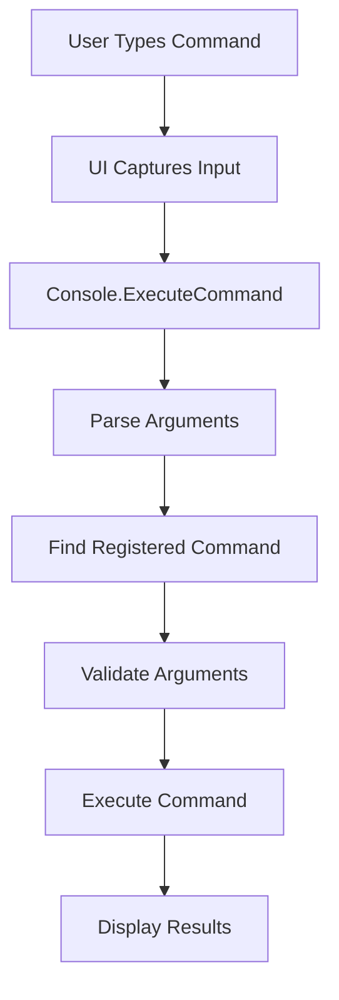

# UCTools Command Console

A flexible, extensible command console system for Unity games that provides runtime debugging, configuration management, and custom command execution.

## Features

- **Runtime Command Execution** - Execute commands during gameplay for debugging and testing
- **Modular Architecture** - Easy to add new commands without modifying core system
- **Auto-Discovery** - Automatically finds and registers commands via attributes
- **Type-Safe Interface** - Strongly typed command system with validation
- **Tab Completion** - Intelligent auto-completion for commands and variables
- **Command History** - Navigate through previous commands with up/down arrows
- **Flexible UI** - Pluggable UI system supporting multiple frontend implementations
- **Integration Ready** - Works seamlessly with ConfigVar and other UCTools systems

## Prerequisites

This console system requires the following UCTools repositories:

### Required Dependencies
- **[UCTools_ConfigVar](link-to-configvar-repo)** - Configuration variable system for persistent settings
- **[UCTools_Utilities](link-to-utilities-repo)** - Core utility functions and extensions

### Unity Requirements
- Unity 2021.3 LTS or later
- .NET Standard 2.1 or .NET Framework 4.x

## Installation

### 1. Install Dependencies
First, install the required UCTools packages:

```bash
# Install via Unity Package Manager or download from repositories
UCTools_ConfigVar
UCTools_Utilities
```

### 2. Install Command Console
```bash
# Clone or download this repository into your Unity project
git clone https://github.com/gary-boyle/UCTools_CommandConsole.git
```

### 3. Basic Setup
I use the ConsoleManager.cs script as a Singleton, but you can initialize the ConsoleGUI and Console objects however you like. 
```

## Architecture Overview

### Core Components

```
UCTools_CommandConsole
├── Console.cs                      # Main console system and command execution
├── ConsoleContext.cs               # Safe context for command execution
├── ConsoleGUI.cs                   # Setup and initialize the UGUI objects
└── Commands/                      
    ├── ConsoleCommandBase.cs       # Base class for easy command creation
    ├── ConsoleCommandRegistry.cs   # Base class for easy command creation
    ├── HelpCommand.cs              # Basic help and lists possible commands
    ├── ExecCommand.cs              # Execute commands contained in a text file
    ├── VarsCommand.cs              # List all the possible ConfigVariables
    ├── WaitCommand.cs              # Wait a certain amount of time before launching command
    ├── ExampleCommand.cs           # Example of how to setup a spawn command
    └── [Your Custom Commands]
└── Interfaces/                     
    ├── IConsoleUI.cs               # Interface for UI implementations  
    ├── IConsoleCommand.cs          # Interface for individual commands
    ├── IConsoleContext.cs          # Context interface providing access to console functionality
└── Prefab/                          
    ├── ConsoleManager.prefab       # Basic UGUI setup 
└── Utilities/                      # 
    ├── CommandUtilities.cs         # Some parsing utilities for converting text
```

### How It Works

1. **Initialization**: Console system auto-discovers commands via reflection (only at startup)
2. **Registration**: Commands implementing `IConsoleCommand` are automatically registered
3. **Input Processing**: UI sends raw command strings to console for parsing
4. **Execution**: Console parses arguments and executes matching commands
5. **Output**: Commands use `IConsoleContext` to send results back to UI

### Command Lifecycle



## 📝 Creating Custom Commands

### Method 1: Simple Command (Recommended)

Create a new file in the `Commands/` folder:

```csharp
using UnityEngine;

namespace ConsoleCommands
{
    /// <summary>
    /// Example: Simple command to log a message
    /// Usage: say hello world
    /// </summary>
    public class SayCommand : ConsoleCommandBase
    {
        public override string CommandName => "say";
        public override string Description => "Print a message to console";
        public override string Category => "Utility";

        public override void Execute(string[] args, IConsoleContext context)
        {
            if (args.Length == 0)
            {
                context.WriteError("No message provided!");
                context.WriteLine(GetUsage());
                return;
            }

            string message = string.Join(" ", args);
            context.WriteLine($"Message: {message}");
        }

        public override string GetUsage()
        {
            return "Usage: say <message>\nExample: say Hello World!";
        }

        public override bool ValidateArgs(string[] args)
        {
            return args.Length > 0;
        }
    }
}
```

### Method 2: Advanced Command with Complex Logic

```csharp
using UnityEngine;

namespace ConsoleCommands  
{
    /// <summary>
    /// Advanced command example with multiple sub-commands
    /// Usage: scene load MainMenu
    ///        scene reload
    ///        scene list
    /// </summary>
    public class SceneCommand : ConsoleCommandBase
    {
        public override string CommandName => "scene";
        public override string Description => "Scene management operations";
        public override string Category => "System";

        public override void Execute(string[] args, IConsoleContext context)
        {
            if (args.Length == 0)
            {
                ShowCurrentScene(context);
                return;
            }

            switch (args[0].ToLower())
            {
                case "load":
                    LoadScene(args, context);
                    break;
                case "reload":
                    ReloadCurrentScene(context);
                    break;
                case "list":
                    ListAvailableScenes(context);
                    break;
                default:
                    context.WriteError($"Unknown subcommand: {args[0]}");
                    context.WriteLine(GetUsage());
                    break;
            }
        }

        private void LoadScene(string[] args, IConsoleContext context)
        {
            if (args.Length < 2)
            {
                context.WriteError("Scene name required");
                return;
            }

            string sceneName = args[1];
            try
            {
                UnityEngine.SceneManagement.SceneManager.LoadScene(sceneName);
                context.WriteLine($"Loading scene: {sceneName}");
            }
            catch (System.Exception e)
            {
                context.WriteError($"Failed to load scene '{sceneName}': {e.Message}");
            }
        }

        // ... other methods

        public override string GetUsage()
        {
            return "Usage: scene [command]\n" +
                   "  scene          - Show current scene\n" +
                   "  scene load <name> - Load specified scene\n" +
                   "  scene reload   - Reload current scene\n" +
                   "  scene list     - List available scenes";
        }
    }
}
```

### Method 3: Integration with ConfigVar System

```csharp
namespace ConsoleCommands
{
    public class GraphicsCommand : ConsoleCommandBase  
    {
        // Reference ConfigVars from UCTools_ConfigVar
        [ConfigVar(Name = "graphics.quality", DefaultValue = "2", Description = "Graphics quality level")]
        static ConfigVar graphicsQuality;

        public override string CommandName => "graphics";
        public override string Description => "Graphics settings management";

        public override void Execute(string[] args, IConsoleContext context)
        {
            if (args.Length == 0)
            {
                context.WriteLine($"Current quality level: {graphicsQuality.IntValue}");
                return;
            }

            if (args[0] == "set" && args.Length == 2)
            {
                if (TryParseInt(args[1], out int quality, context))
                {
                    graphicsQuality.Value = quality.ToString();
                    QualitySettings.SetQualityLevel(quality);
                    context.WriteLine($"Graphics quality set to: {quality}");
                }
            }
        }

        public override string GetUsage()
        {
            return "Usage: graphics [set <level>]\n" +
                   "  graphics       - Show current quality\n" +
                   "  graphics set 2 - Set quality level to 2";
        }
    }
}
```

## Built-in Commands

The console comes with several built-in commands:

| Command | Description | Usage |
|---------|-------------|-------|
| `help` | Show available commands | `help` or `help <command>` |
| `vars` | Show configuration variables | `vars` or `vars <filter>` |
| `wait` | Wait specified frames | `wait` or `wait 60` |
| `exec` | Execute commands from file | `exec script.txt` |
| `spawn` | Create primitive objects | `spawn cube 0 5 0 red` |

## Usage Examples

### Basic Console Usage
```bash
# In-game console (press ~ to open)
> help                    # Show all commands
> help spawn              # Show detailed help for spawn command
> vars                    # Show all variables
> vars player             # Show variables containing "player"
> spawn cube 0 10 0 red   # Create red cube at (0,10,0)
> exec startup.cfg        # Execute commands from file
```

### Scripting with Console
Create `startup.cfg` in your project root:
```bash
// Startup configuration script
echo "Loading development settings..."
graphics set 1
player.speed 10
debug.showcolliders 1
spawn cube 0 5 0 green
echo "Development setup complete!"
```

## Configuration

### Command Categories
Organize your commands by setting the `Category` property:

- `"General"` - Default category
- `"Scripting"` - Scripting commands 
- `"System"` - Core system commands
- `"Debug"` - Development and debugging tools
- `"Game"` - Game-specific functionality  
- `"Graphics"` - Rendering and visual settings
- `"Audio"` - Sound and music controls
- `"Network"` - Multiplayer and networking
- `"Development"` Spawning objects etc

### Command Chaining
```csharp
// Commands can queue other commands
context.EnqueueCommand("graphics set 2");
context.EnqueueCommand("wait 60");
context.EnqueueCommand("scene reload");
```


## 📄 License

I didn't write the original setup for this, I borrowed heavily from the Unity FPS Sample project and extended it to try and make it a bit more modular.

## 🔗 Related Repositories

- [UCTools_ConfigVar](link-to-configvar-repo) - Configuration variable system
- [UCTools_Utilities](link-to-utilities-repo) - Core utility functions
- [UCTools_DebugTools](link-to-debugtools-repo) - Additional debugging utilities

---
